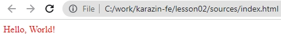
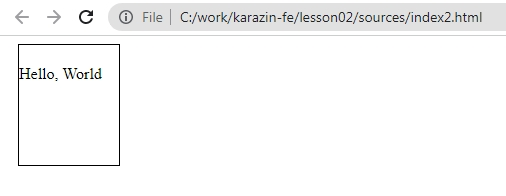

# Використання CSS
Для оформлення тексту при створенні Web-інтерфейсу використовується технологія CSS (Cascading Style Sheets) "Каскадна таблиця стилей". Таблиця стилей оформлення тексту. Вона є каскадною, тому що вплив стилей на відображення тексту в інтерфейсі відбувається каскадно.  

При цьому CSS використовується як для оформлення тексту, так і для його позиціонування на сторінці.  
Почнемо знайомство з CSS зі стилей, які оформлюють текст та фон.  

Але до того, щоб ми використовували таблицю стилей, нам треба її підключити до HTML. Адже HTML - це ключова технологія і всі інші технології при сторвенні Web-інтерфейсів підключється через HTML.  

```
<!DOCTYPE html>
<html lang="en">
<head>
    <meta charset="UTF-8">
    <meta http-equiv="X-UA-Compatible" content="IE=edge">
    <meta name="viewport" content="width=device-width, initial-scale=1.0">
    <title>Document</title>
</head>
<body>
    <span style="color:red;">Hello, World!</span>
</body>
</html>
```
  

Це найпростіший для розуміння спосіб підключення таблиці стилей. Це стиль на практиці використовується рідко.  Проте для початку - його достатньо для розуміння роботи таблиці стилей цього достатньо.  
Для оформлення стиля використовується властивість та значення. В данному випадку властивість **color** (колір тексту), а значення **red** (червоний).  

## Валастивості
### Оформлення тексту
* **font-size:20px;** - розмір шрифту 20 пікселів.
* **font-family: Verdana;** - тип шрифту Verfana.
* **font-style: italic;** - стиль тексту - курсив.
* **font-weight: bold;** - товщина шрифту.
* **background: gray**;  - фон сірий.
* **text-decoration: underline;** - оформлення тексту, підкреслювання.

Э три типи блоків - строчний, блочний та строчно-блочний.
Строчні блоки - це такі, які максимально схожі на тексти. У таких блоків є стилі тексту, але немає відступив та розмірів. Блочні - мають ширину та висоту та відступи, але на мають властивості оформлення тексту. Строчно-блочні - мають властивості оформлення тексту, ширину та висоту та відступи,

### Відступи
* **width: 100px;** - ширина 100 пікселів
* **height: 100px;** - висота 100 пікселів
* **border: 1px solid black;** - границя 1 піксель із неперервною лінією чорна
* **margin-left: 10px;** - зовнішній лівий відступ 10 пікселів
* **padding-top: 20px;** - внутрішній верхній відступ 20 пікселів.
  
```
<!DOCTYPE html>
<html lang="en">
<head>
    <meta charset="UTF-8">
    <meta http-equiv="X-UA-Compatible" content="IE=edge">
    <meta name="viewport" content="width=device-width, initial-scale=1.0">
    <title>Document</title>
    <style>
        .d1{
            width: 100px;
            height: 100px;
            border: 1px solid black;
            margin-left:10px;
            padding-top: 20px;
        }
    </style>
</head>
<body>
    <div class="d1">
        Hello, World
    </div>
</body>
</html>
```

  