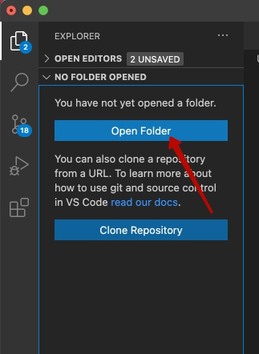
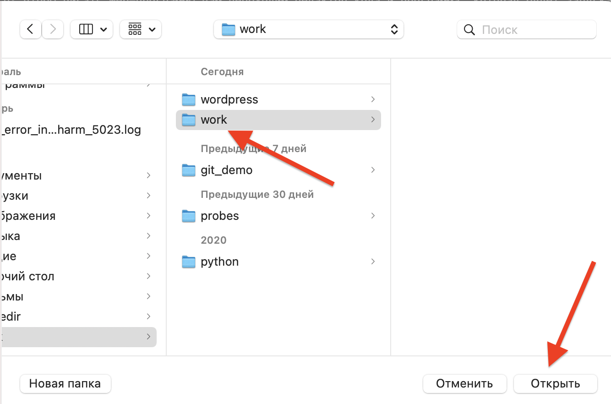
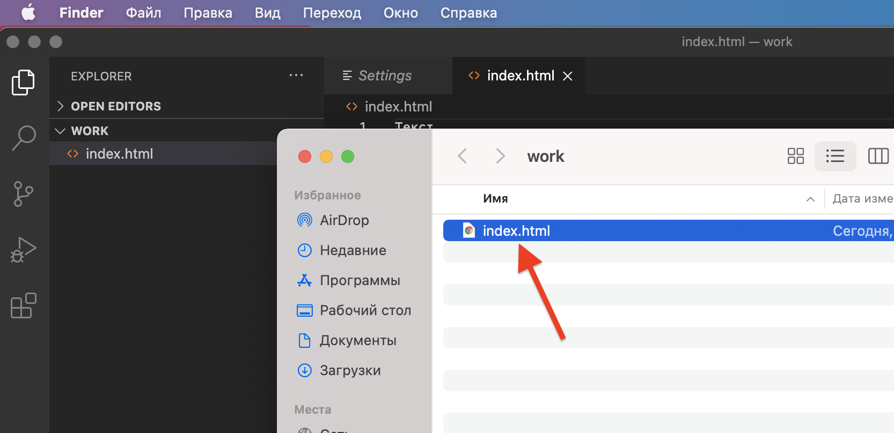
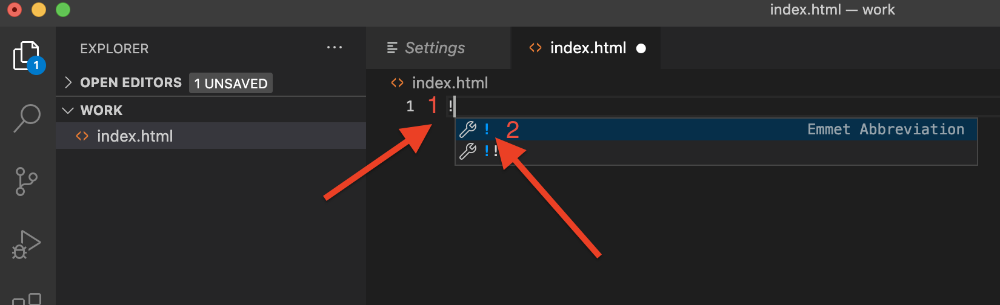
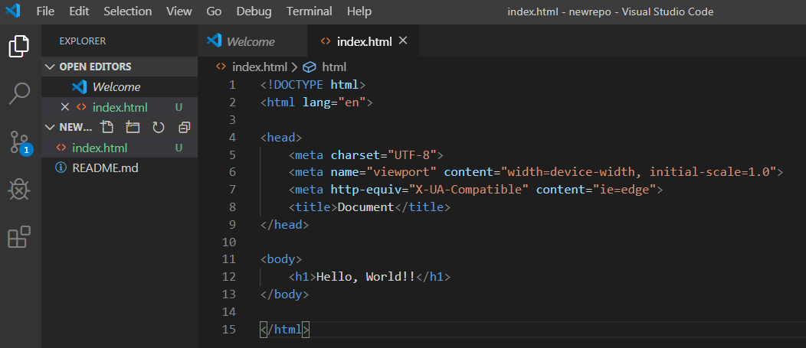
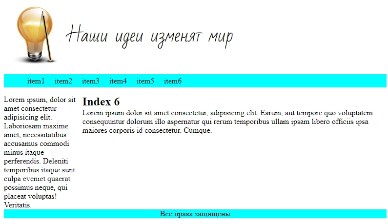
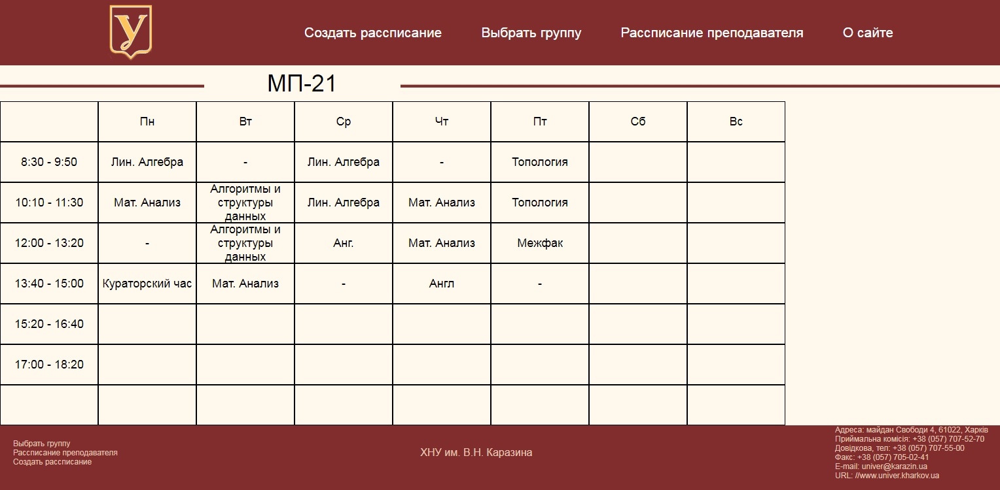
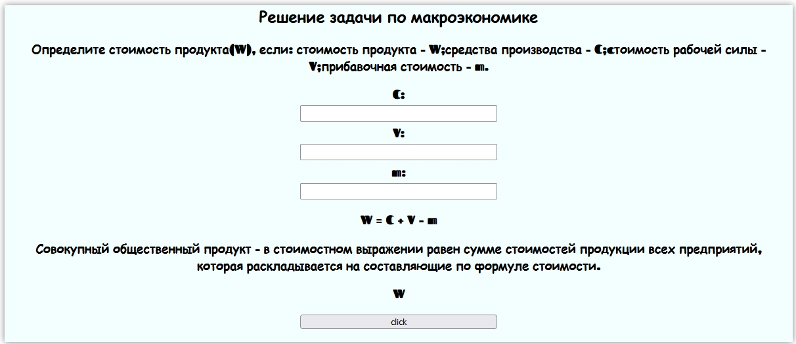
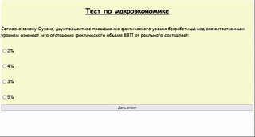
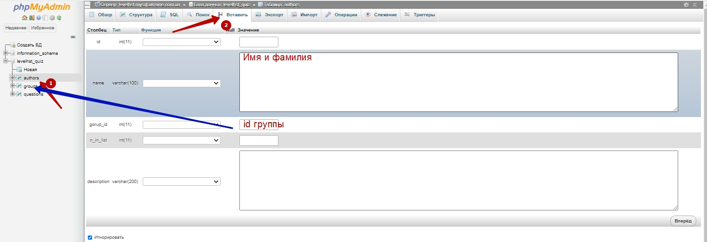

# Web-программирование
Курс предназначен для того, чтобы освоить элементы обучения для создания сайтов, освоив базу верстки сайтов, динамического изменения данных на сайте, работы бекенда и работы фреймворка react.js.  
В качестве практических заданий на данном курсе верстаются страницы сайтов, страницы с вычислениями, одностраничное приложение (one page application) в функционале которого реализованы тесты.  

В каждом блоке - описание выполнения задания (которое достаточно скопировать и запустить), а также усложняющие элементы (для выполнения которых необходимо вставить свой контент, изменить параметры или же реализовать продемонстрированную технологию в новых условиях).

## Рабочее место
Для того: чтобы писать Web-программы нам необходим редактор кода и программа, которая будет запускать эти программы (браузер).  
В качестве редактора кода мы будем использовать <a href = "https://code.visualstudio.com/download">Microsoft VS Code</a>, а в качестве браузера будем использовать <a href = "https://www.google.com/chrome/">Google Crome</a>.  
  
## Написание текста и его отображение в браузере

Для работы создайте папку **work** в корне одного из дисков (лучше на диске D, чтобы ограничения операционной системы не мешали работать).


1. Откройте созданную папку **work** в **MS VS Code**.  
  
 
  

2. Создадим файл **index.html** (с помощью кнопки **New File**)  
  

3. В рабочем поле введите слово "Текст"
  

4. Сохраните файл
  

5. Откройте и запустите файл **index.html** в папке **work**.
  

6. Вы увидите результат:
  

В ближашее время мы будем вводить код в рабочее поле редактора MS VS Code, сохранять код и результат видеть в браузере (при каждом новом сохранении обновляя страницу).

## Первые теги
**Теги** (метки) - позволяют изменять начертание текста. Тег `<b>` делает текст полужирным, тег `<i>` - написанным курсивом, а тег `<u>` - подчеркнутым.  
Для того, чтобы тег изменил наертание текста он должен быть заключен между открывающимся (`<b>`) и закрывающимся ((`</b>`)) тегом.  
Напишите в рабочем поле редактора **MS VS Code** следующий текст:
 
```html
<b>Полужирный Текст</b> <i>Курсивный текст</i> <u>Подчеркнутый текст</u>
```

   

Сохраните введенные теги и откройте файл index.html в браузере.  
  

## Абзац, ссылка, картинка


## Структура HTML-документа

1. В рабочем поле введем символ **!**, а далее, после появления выпадающего окна, нажмите **enter**.
  
  

## Task1.

**Оформление текста(Новость)** 

|№|Альтернативные задания|Код|Скриншот|
|---|---|---|---|
|1|1. Создайте страницу с тегами i,b,img,p,a|<a href = "https://github.com/mikh-maksi/karazin-fe/tree/main/simple-way#html">Код страницы</a>||

## HTML
```html
<h1>Объявлен стартовый состав сборной Украины на матч против Казахстана</h1>

<p>В <i>среду, 12 сентября</i>, в <b>Нур-Султане</b> на "<b>Астана Арене</b>" в рамках матча квалификации чемпионата мира-2022 
    в <b>Катаре</b> встретятся сборные <b>Казахстана</b> и <b>Украины</b>.</p>

<p>Стал известен стартовый состав сборной Украины:</p>

<p>Украина: Пятов, Миколенко, Мативенко, Забарный, Караваев, Соболь, Зинченко, Сидорчук, Ярмоленко, Буяльский, Яремчук.</p>

<p>ZN.UA проведет онлайн-трансляцию матча Казахстан - Украина.</p>

<p>Украина после трех игр отбора имеет в активе три очка, трижды сыграв вничью с Францией, Финляндией и Казахстаном. 
    Первая встреча команд в марте в Киеве завершилась со счетом 1:1.</p>

<p>Отметим, что этот поединок станет первым у руля сборной Украины для нового наставника команды Александра Петракова. 
    Начало встречи – в 17:00.</p>
<a href = "https://zn.ua/SPORT/objavlen-startovyj-sostav-sbornoj-ukrainy-na-match-protiv-kazakhstana.html">Взято с сайта Зеркало Недели</a>
```

## GitHub.
**Вставка текста на GitHub Pages**
Создание репозитария

1. Заходим на **github.com** (если не зарегистрированы - зарегистрироваться)
  
  

2. Создаем новый репозитарий


3. Или используем существующий


4. Нажимаем кнопку **"clone or download"**


5. Создаем новую папку и в ней на пустом месте нажимаем правую клавиши мыши, выбираем **gitBush Here** (если программа не установлена - скачать: https://git-scm.com/download/ )


6. В открывшемся окне пишем   и нажимаем комбинацию клавиш **Shift+INS**
  
  

Или нажимаем правой клавишей мыши после набранного Вводим команду **git push** (возможно - нужно будет указать логин и пароль к git hub) и выбираем "Вставить" (Paste)  


7. Нажимаем **"Enter"**  

  

8. Теперь в нашей созданной папке появилась новая под папка с названием таким же как название репозитария (в нашем случае **newrepo**)  
  

9.  Заходим в папку, создаем сайт (файлы **index.html**, **style.css**, картинки, шрифты, др.)
  
 

10. Создаем необходимые файлы  
  
  
11. Переходим в проводник и нажимаем правой клавишей на пустом месте и выбираем gitbush Here
  


В открывшимся окне пишем **git add .**  

  

12. Далее - вводим команду **git commit -m "first commit"**

  

13. Вводим команду git push (возможно - нужно будет указать логин и пароль к git hub)

  

## Task2

**Тематический сайт (inline-blocks)**

|№|Задание|Код|Скриншот|
|---|---|---|---|
|2|1. Создайте сайт, используя свойство display:inline-block|<a href = "https://github.com/mikh-maksi/karazin-fe/tree/main/simple-way#html">Код страницы</a>||


### inline-block
```html
<!DOCTYPE html>
<html lang="en">
<head>
    <meta charset="UTF-8">
    <meta http-equiv="X-UA-Compatible" content="IE=edge">
    <meta name="viewport" content="width=device-width, initial-scale=1.0">
    <title>Document</title>
    <link rel="stylesheet" href="style2.css">
    <link href="https://fonts.googleapis.com/css?family=Bad+Script" rel="stylesheet">
</head>
<body>
    <div class="wrapper">
        <header>
            <div class="logo"></div>
            <div class="title">Наши идеи изменят мир</div>
        </header>
        <nav>
            <ul class = "list">
                <li><a href="https://www.google.com/">item1</a></li>
                <li><a href="index2.html">item2</a></li>
                <li><a href="https://karazin.ua/">item3</a></li>
                <li><a href="http://www.cyber.kharkov.ua/">item4</a></li>
                <li><a href="https://city.kharkov.ua/">item5</a></li>
                <li><a href="index6.html">item6</a></li>
            </ul>
        </nav>
        <main>
            <aside class="left">
Lorem ipsum, dolor sit amet consectetur adipisicing elit. Laboriosam maxime amet, necessitatibus accusamus commodi minus itaque perferendis. Deleniti temporibus itaque sunt culpa eveniet quaerat possimus neque, qui placeat voluptas! Veritatis.
            </aside>
            <article class="right">
                <h2>Index 6</h2>
Lorem ipsum dolor sit amet consectetur, adipisicing elit. Earum, aut tempore quo voluptatem consequuntur dolorum illo aspernatur qui rerum temporibus ullam ipsam libero officiis ipsa maiores corporis id consectetur. Cumque.
            </article>
        </main>
        <footer>Все права защищены</footer>

    </div>
</body>
</html>
```
```css
.logo{
    display: inline-block;
    vertical-align: middle;
    height: 128px;
}
.title{
    display: inline-block;
    vertical-align: middle;
    font-family: 'Bad Script', cursive;
    font-size: 36px;

}
.list{
    background: cyan;
    line-height: 25px;
}
.list li{
    list-style: none;
    display:inline-block;
    text-align:center;

}
.list li a{
    display:inline-block;
    width: 50px;
    text-decoration: none;
    border: 1px solid transparent;
    color:black;
}
.list li a:hover{
    text-decoration: underline;
    border: 1px solid;
}

.left{
    display: inline-block;
    width: 20%;
}
.right{
    vertical-align: top;
    display: inline-block;
    width: calc(80% - 4px);
}
footer{
    text-align: center;
    background: cyan;
}
```

## Flexfroggy
|№|Задание|Код|Скриншот|
|---|---|---|---|
|3|1. Пройти задания на сайте <a href ="https://flexboxfroggy.com/#ru">FlexFroggy</a><br>2. Пройти задания на сайте <a href ="https://flukeout.github.io/">CSS Diner</a><br>3. Пройти задания на сайте <a href ="http://www.flexboxdefense.com/">FlexBox Defence</a>|---||

## Task4
**Тематический сайт (flexbox)**

|№|Задание|Код|Скриншот|
|---|---|---|---|
|4|1. Сверстать рассписание своей группы<br>2. Сверастать страницу с фотографиями преподавателей своей кафедры (<a href = "http://www.cyber.kharkov.ua/page-teachers.html">пример</a>) |<a href = "https://github.com/mikh-maksi/karazin-fe/tree/main/simple-way#Timetable">Код страницы</a>||

### Timetable
```html
<!DOCTYPE html>
<html lang="en">
<head>
    <meta charset="UTF-8">
    <meta http-equiv="X-UA-Compatible" content="IE=edge">
    <meta name="viewport" content="width=device-width, initial-scale=1.0">
    <title>Document</title>
    <link rel="stylesheet" href="css/style.css">
</head>
<body>
    <div class="wrapper">
        <header>
            <div class="upper">
                
            <nav class="menu">
                <ul>
                    <li><a href="">Создать рассписание </a></li>
                    <li><a href="">Выбрать группу </a></li>
                    <li><a href="">Рассписание преподавателя </a></li>
                    <li><a href="">О сайте </a></li>
                </ul>
            </nav>
            </div>
        </header>
        <main>
            <div class="mainup">
                <div class="line"></div>
                <div class="groupname">МП-21</div>
                <div class="line2"></div>
            </div>
            <div class="timetable">
                <div class="s0">
                    <div class="l1"></div>
                    <div class="l2">Пн</div>
                    <div class="l3">Вт</div>
                    <div class="l4">Ср</div>
                    <div class="l5">Чт</div>
                    <div class="l6">Пт</div>
                    <div class="l7">Сб</div>
                    <div class="l8">Вс</div>
                </div>
                <div class="s1">
                    <div class="l1">8:30 - 9:50</div>
                    <div class="l2">Лин. Алгебра</div>
                    <div class="l3">-</div>
                    <div class="l4">Лин. Алгебра</div>
                    <div class="l5">-</div>
                    <div class="l6">Топология</div>
                    <div class="l7"></div>
                    <div class="l8"></div>
                </div>
                <div class="s2">
                    <div class="l1">10:10 - 11:30</div>
                    <div class="l2 ">Мат. Анализ</div>
                    <div class="l3">Алгоритмы и структуры данных</div>
                    <div class="l4">Лин. Алгебра</div>
                    <div class="l5">Мат. Анализ</div>
                    <div class="l6">Топология</div>
                    <div class="l7"></div>
                    <div class="l8"></div>
                </div>
                <div class="s3">
                    <div class="l1">12:00 - 13:20</div>
                    <div class="l2">-</div>
                    <div class="l3">Алгоритмы и структуры данных</div>
                    <div class="l4">Анг.</div>
                    <div class="l5">Мат. Анализ</div>
                    <div class="l6">Межфак</div>
                    <div class="l7"></div>
                    <div class="l8"></div>
                </div>
                <div class="s4">
                    <div class="l1">13:40 - 15:00</div>
                    <div class="l2">Кураторский час</div>
                    <div class="l3">Мат. Анализ</div>
                    <div class="l4">-</div>
                    <div class="l5">Англ</div>
                    <div class="l6">-</div>
                    <div class="l7"></div>
                    <div class="l8"></div>
                </div>
                <div class="s5">
                    <div class="l1">15:20 - 16:40</div>
                    <div class="l2"></div>
                    <div class="l3"></div>
                    <div class="l4"></div>
                    <div class="l5"></div>
                    <div class="l6"></div>
                    <div class="l7"></div>
                    <div class="l8"></div>
                </div>
                <div class="s6">
                    <div class="l1">17:00 - 18:20</div>
                    <div class="l2"></div>
                    <div class="l3"></div>
                    <div class="l4"></div>
                    <div class="l5"></div>
                    <div class="l6"></div>
                    <div class="l7"></div>
                    <div class="l8"></div>
                </div>
                <div class="s7">
                    <div class="l1"></div>
                    <div class="l2"></div>
                    <div class="l3"></div>
                    <div class="l4"></div>
                    <div class="l5"></div>
                    <div class="l6"></div>
                    <div class="l7"></div>
                    <div class="l8"></div>
                </div>
            </div>
        </main>
        <footer>
            <div class="down">
                <div class="fm1">
                    <nav>
                        <ul>
                            <li><a href="">Выбрать группу</a></li>
                            <li><a href="">Рассписание преподавателя</a></li>
                            <li><a href="">Создать рассписание</a></li>
                        </ul>
                    </nav>
                    
                </div>
                <div class="fm2">ХНУ им. В.Н.  Каразина</div>
                <div class="fm3">Адреса: майдан Свободи 4, 61022, Харків<br>
                    Приймальна комісія: +38 (057) 707-52-70<br>
                    Довідкова, тел: +38 (057) 707-55-00<br>
                    Факс: +38 (057) 705-02-41<br>
                    E-mail: univer@karazin.ua<br>
                    URL: //www.univer.kharkov.ua</div>
            </div>
        </footer>
    </div>
</body>
</html>
```

```css
*{
    margin:0;
    padding:0;
}
body{
    background: url('../img/pixel.png');
}
.wrapper{
    display: flex;
    flex-direction: column;
}
header{
    height:100px;
    background-color: #822d2d;
}
footer{
    height:100px;
    background-color: #822d2d;    
}
.upper{
    width:1200px;
    margin: 0 auto;
    height: 100%;
    display: flex;
    justify-content: space-between;
    align-items: center;
}
.menu ul{
    display: flex;
    width:900px;
    justify-content: space-between;
    align-items: center ;
}
.menu ul li{
    list-style: none;
}
.menu ul li a{
    color:white;
    font-size:21px;
    font-family: Arial;
    text-decoration: none;
}
.menu ul li a:hover{
    text-decoration: underline;
}
.mainup{
    display: flex;
}
.line, .line2{
    height: 55px;
    background: url('../img/line.png');
}
.line{
    width:calc(40% - 300px);
}
.line2{
    width:60%;
}
.groupname{
    display: flex;
    justify-content: center;
    align-items: center;
    width:300px;
    text-align: center;
    font-family: Arial, Helvetica, sans-serif;
    font-size:36px;
    background: url('../img/pixel.png');
}
.main div{
    border: 1px solid;
}

.timetable{
    width: 1200px;
}

.timetable div{
    display: flex;
}
.timetable div div{
    height:60px;
    width:150px;
    display: flex;
    justify-content: center;
    align-items: center;
    font-family: Arial;
    font-size: 18px;
    border: 1px solid;
    text-align: center;
}

.down{
    display: flex;
    justify-content: space-between;
    color:#e4c4b5;
    font-family: Arial, Helvetica, sans-serif;
    font-size: 12px;
    padding-left: 20px;
    padding-right: 20px;
}
.down ul li{
    list-style: none;
}
.down a{
    justify-content: space-between;
    color:#e4c4b5;
    font-family: Arial, Helvetica, sans-serif;
    text-decoration: none;
}
.down a:hover{
    text-decoration: underline;
}
.down div{
    display: flex;
    justify-content: center;
    align-items: center;
}

.fm2{
    font-size: 16px;
}
```
## Task5
**Калькулятор**

|№|Задание|Код|Скриншот|
|---|---|---|---|
|5|1. Реализуйте расчетный калькулятор <br> 2. Добавьте к калькулятору основы теории<br> 3. Реализуйте в калькуляторе значения по-умолчанию (с помощью placeholder)<br>4. Добавьте 5 условий задач, которые решаются с помощью калькулятора|<a href = "https://github.com/mikh-maksi/karazin-fe/tree/main/simple-way#Calculator">Код страницы</a>||

### Calculator
```html
<!DOCTYPE html>
<html lang="en">
<head>
    <meta charset="UTF-8">
    <meta name="viewport" content="width=device-width, initial-scale=1.0">
    <title>Calculator</title>
    <link rel="preconnect" href="https://fonts.gstatic.com">
    <link href="https://fonts.googleapis.com/css2?family=Fascinate&display=swap" rel="stylesheet">
    <link rel="stylesheet" href="style.css">
</head>
<body>


   <div class="container">
    <h2 class="title"> Решение задачи по микроэкономике </h2>
       <h3 class="task"> Определите ВВП, исчисленный производственным методом, если:
           рыночная цена выпущенной продукции - <b>P</b>; текущие материальные издержки - <b>М</b>; амортизационные
           отчисления - <b>А</b>; косвенные налоги на товары и услуги - <b>Н</b>; государственные субсидии
           на их производство - <b>С</b>.</h3>
      <div class="task-content">
       <h3> P:</h3><input id="p" value="" autocomplete="off">
       <h3> M:</h3><input id="m" value="" autocomplete="off">
       <h3> A:</h3><input id="a" value="" autocomplete="off">
       <h3> H:</h3><input id="n" value="" autocomplete="off">
       <h3> C:</h3><input id="c" value="" autocomplete="off">
      </div>
          <div class="task-text">
          <h3 class="formula">
              ВВП = ΣВДС + Н - С, где
              ΣВДС - сумма валовой добавленной стоимости в основных ценах всех секторов или
              отраслей экономики;
          </h3>
          <h3> Добавленная стоимость – это валовая продукция предприятия (или рыночная цена
              выпущенной продукции) за минусом текущих материальных издержек, но с включением в
              неё отчислений на амортизацию (так как основные фонды предприятия принимают
              участие в создании новой стоимости производимой продукции). </h3>
          <h3> ВВП:</h3> <p id="res"></p></div>
       <div class="button">
           <button id="btn"> click </button>
       </div>


   </div>
<script src="js.js"></script>
</body>
</html>
```
CSS
```css
* {
    box-sizing: border-box;
}
body {
    font-family: 'Fascinate', cursive;
}
.container {
    width: 1200px;
    margin: 0 auto;
    background: azure;
    box-shadow: 0 0 10px rgba(0,0,0,0.5);
}
.task-content h3 {
    margin: 5px;
}
h3,h2, button{
    text-align: center;
}
.task-content, .task-text, .button {
    text-align: center;
}
input {
    font-size: 17px;
    text-align: center;
    padding: 10px;
    height: 25px;
    width: 300px;
}
.task-text {
    margin: 0 35px;
}
button {
    cursor: pointer;
    width: 200px;
    margin-bottom: 20px;
}
p {
    font-size: 25px;
    margin: 15px 0;
}

```
JS
```js
btn.addEventListener("click",f_out);

   function f_out (){
       q = Number(p.value) - Number(m.value) + Number(a.value) + Number(n.value) - Number(c.value);
       res.innerHTML = q;
   }
```
<p class="codepen" data-height="300" data-default-tab="html,result" data-slug-hash="jOGEbzo" data-user="mikh-maksi" style="height: 300px; box-sizing: border-box; display: flex; align-items: center; justify-content: center; border: 2px solid; margin: 1em 0; padding: 1em;">
  <span>See the Pen <a href="https://codepen.io/mikh-maksi/pen/jOGEbzo">
  Untitled</a> by Mikhail (<a href="https://codepen.io/mikh-maksi">@mikh-maksi</a>)
  on <a href="https://codepen.io">CodePen</a>.</span>
</p>
<script async src="https://cpwebassets.codepen.io/assets/embed/ei.js"></script>

## Task6
**Ответ на 1 вопрос**

|№|Задание|Код|Скриншот|
|---|---|---|---|
|6|1. Создайте тест с 4 вариантом ответа, при правильном ответе на вопрос выдается сообщение. <br> 2. Реализуйте вариант теста с текстом|<a href = "https://github.com/mikh-maksi/karazin-fe/tree/main/simple-way#quiz">Код страницы</a>||
### qiuz
**HTML**
```html
<!doctype html>
<html lang="en">
<head>
    <meta charset="UTF-8">
    <meta name="viewport"
          content="width=device-width, user-scalable=no, initial-scale=1.0, maximum-scale=1.0, minimum-scale=1.0">
    <meta http-equiv="X-UA-Compatible" content="ie=edge">
    <title>Document</title>
    <link rel="preconnect" href="https://fonts.gstatic.com">
    <link href="https://fonts.googleapis.com/css2?family=Shippori+Mincho:wght@800&display=swap" rel="stylesheet">
    <link rel="stylesheet" href="style.css">
</head>
<body>
<div class="container">
    <h1 class="title"> Флаги мира </h1>

  <h3 class="quest"> Какой из предложенных флагов является флагом Грузии?</h3>
    <div class="img">
        <div class="item">
            
            <p> 1 </p>
        </div>
        <div class="item">
            
            <p> 2 </p>
        </div>
        <div class="item">
            
            <p> 3 </p>
        </div>
        <div class="item">
            
            <p> 4 </p>
        </div>
    </div>
<div class="input-style">
    <p> <input type="radio"  name="color" id="f1" > 1</p>
    <p> <input type="radio"  name="color" id="f2" > 2 </p>
    <p> <input  type="radio"  name="color" id="f3" > 3 </p>
    <p> <input  type="radio"  name="color" id="f4" > 4 </p>
</div>
    <button id = "btn" class="answ"> Ответить </button>

    <div class="right_answ">
    <p class="right hdn" id="right">Правильный ответ</p>
    </div>

    <div class="wrong hdn" id="wrong">
        <div class="wrong-content">
            <p class="wrong1" id="wrong1">Неправильный ответ</p>
        </div>

        <button class="answ2" id = "btn1">Посмотреть ответ</button>
    </div>
    <p class="correct hdn" id="answer" > 1 </p>
</div>
<script src="js.js"></script>

</body>
</html>
```
**CSS**
```css
* {
    box-sizing: border-box;
    margin: 0;
    padding: 0;
   text-align: center;
   margin-bottom: 20px;
}
.container {
    font-family: 'Shippori Mincho', serif;
    width: 1200px;
    border-radius: 3%;
    margin: 0 auto;
    box-shadow: 0 0 10px rgba(0,0,0,0.5);
    background: darkseagreen;
}
h3 {
    font-size: 25px;
    padding-bottom: 45px;
}
.title {
    text-align: center;
    padding-bottom: 20px;
}

.img {
    display: flex;
    justify-content: space-around;
    margin: 0;
}
img {
    width: 200px;
    height: 100px;
}
.item p {
    font-size: 30px;
    color: deeppink;
}
input {
    margin: 0;
}
.input-style {
    justify-content: center;
    display: flex;
}
.input-style p {
    margin-right: 20px;
}
.answ, .answ2 {

    font-size: 17px;
    cursor: pointer;
    background: lemonchiffon;
    border-radius: 10%;
    font-weight: bold;
    height: 30px;
}
.answ {
    width: 100px;
}
.answ2 {
    width: 180px;
    margin: 0;
}
.right{
    background-color: rgba(0, 200, 0, 0.5);
}
.wrong1 {
     background-color: rgb(255, 44, 55);
 }
.right_answ,
.wrong-content {
    display: flex;
    justify-content: center;
    margin: 0;
}
.right,
.wrong1{
    padding-bottom: 5px;
    font-size: 20px;
    width: 300px;
    align-content: center;
    border-radius: 5px;
}

.hdn{
padding-bottom: 20px;
font-size: 22px;
display: none;
}

.opend{
background-color: skyblue;
}
.correct {
    font-size: 20px;
    padding-bottom: 20px;
    margin-top: -17px;
}
```
```js
btn.addEventListener("click", f_out);
btn1.addEventListener("click", f_out1);
function f_out (){
    console.log(f1.checked);
    console.log(f2.checked);
    console.log(f3.checked);
    console.log(f4.checked);

    if (f1.checked){
        right.classList.remove("hdn");
        wrong.classList.add("hdn");
        alert("Სწორი პასუხი (Ответ верный!)");
    }else{
        right.classList.add("hdn");
        wrong.classList.remove("hdn");
        alert("მეტი იფიქრე (Подумай еще!)");
    }

}
function f_out1 (){
    answer.classList.toggle("hdn");
    btn1.classList.toggle("opend");
}

```
    

## Task7

**Ответ на несколько вопросов**

|№|Задание|Код|Скриншот|
|---|---|---|---|
|7|1. Создайте тест из 5 вопросов с использованием массива |<a href = "https://github.com/mikh-maksi/karazin-fe/tree/main/simple-way#ArrayQuiz">Код страницы</a>||
### ArrayQuiz
```html
<!DOCTYPE html>
<html lang="en">
<head>
    <meta charset="UTF-8">
    <meta http-equiv="X-UA-Compatible" content="IE=edge">
    <meta name="viewport" content="width=device-width, initial-scale=1.0">
    <title>Document</title>
    <link rel="stylesheet" href="style.css">
    <link rel="preconnect" href="https://fonts.gstatic.com">
    <link href="https://fonts.googleapis.com/css2?family=Balsamiq+Sans:ital@1&display=swap" rel="stylesheet">
</head>
<body>
    <div class="wrapper">
        <h2 class="header">Тест по макроэкономике</h2>
        <p id="question"></p>
        <p><input type="radio" name="variant" id="y1"><span  id = "a1"></span></p>
        <p><input type="radio" name="variant" id="y2"><span  id = "a2"></span></p>
        <p><input type="radio" name="variant" id="y3"><span  id = "a3"></span></p>
        <p><input type="radio" name="variant" id="y4"><span  id = "a4"></span></p>

        <button id = "btn">Дать ответ</button>
    <div class="right_div hidden" id = "right_div">
        <p class="right" id="right">Правильный ответ</p>
        <button id = "btn2">Следующий вопрос</button>
    </div>
    <div class="wrong_div hidden" id="wrong_div">
        <p class="wrong" id="wrong">Неправильный ответ</p>
        <button id = "btn1">Посмотреть ответ</button>
        <p id="answer" class = "hidden"></p>
    </div>

    
    </div>
    <input type="hidden" value = "0" id = "n_question">
    
    <script src="js.js"></script>
</body>
</html>
```
```css
.wrapper{
    margin:0 auto;
    width:900px;
    display: flex;
    flex-direction: column;
    font-family: 'Balsamiq Sans', cursive;
    font-family: 'Train One', cursive;
    background-color: lightgoldenrodyellow;
    border-radius: 10px;
}
.header{
    text-decoration: underline;
    text-align: center;
}
.right{
    background-color: rgba(0, 200, 0, 0.5);
    border-radius: 5px;
    padding-left:5px;
}
.wrong{
    background-color: rgb(255, 44, 55);
    border-radius: 5px;
    padding-left:5px;
}
.hidden{
    display: none;
}
#btn1{
    background-color: -internal-light-dark(rgb(239, 239, 239), rgb(59, 59, 59));
}
.opend{
    background-color: skyblue;
}
```

```js
let question_arr = ["Согласно закону Оукэна, двухпроцентное превышение фактического уровня безработицы над его естественным уровнем означает, что отставание фактического объема ВВП от реального составляет:","Инфляция издержек развивается при:","Кривая, показывающая связь между уровнем безработицы и годовым темпом, роста цен — это:","Государственный долг—это:","Фискальная политика может быть:"]
let a1_arr = ["2%","умеренном росте объемов денежной массы","кривая Лоренца","задолженность населения, фирм, банков и зарубежных государств передправительством данной страны","стимулирующей"]
let a2_arr = ["4%","росте цен на ресурсы","кривая Лаффера"," задолженность правительства перед населением страны","сдерживающей"]
let a3_arr = ["3%","росте цен на потребительские товары и услуги","кривая Филлипса","задолженность правительства данной страны перед иностранными государствами","автоматической"]
let a4_arr = ["5%","снижении учетной ставки"," кривая спроса","задолженность правительства перед всеми хозяйствующими субъектами как данной страны, так и зарубежных стран","все ответы верны"]
let answer_arr = ["5%","росте цен на ресурсы","кривая Филлипса","задолженность правительства перед всеми хозяйствующими субъектами как данной страны, так и зарубежных стран","все ответы верны"]
let n_right_answer_arr = [4,2,3,4,4]
let n_right_answer = 1;
let right_answers = 0;
let n_answer = 4;

question.innerHTML=question_arr[n_question.value];
a1.innerHTML = a1_arr[n_question.value];
a2.innerHTML = a2_arr[n_question.value];
a3.innerHTML = a3_arr[n_question.value];
a4.innerHTML = a4_arr[n_question.value];
answer.innerHTML = answer_arr[n_question.value];

n_right_answer = n_right_answer_arr[n_question.value];
console.log(n_question.value)
btn.addEventListener("click", f_out);
btn1.addEventListener("click", f_out1);
btn2.addEventListener("click", f_out2);
  function f_out (){
        console.log(y1.checked);
        console.log(y2.checked);
        console.log(y3.checked);
        console.log(y4.checked);

        if (y1.checked){ n_a = 1;}
        if (y2.checked){ n_a = 2;}
        if (y3.checked){ n_a = 3;}
        if (y4.checked){ n_a = 4;}
        console.log(n_a);
        
        if (n_a == n_right_answer){
        right_answers += 1;
        right_div.classList.remove("hidden");
        wrong_div.classList.add("hidden");
        console.log("n_question.value = "+n_question.value);
        console.log("n_answer = "+n_answer);
        if (n_question.value == n_answer){
            btn2.classList.add("hidden");
            let el1 = document.createElement("p");
            el1.innerHTML = "<b>"+right_answers+"</b>";
            right_div.appendChild(el1);
        }
        }
        else{
        right_answers-=1;
        right_div.classList.add("hidden");
        wrong_div.classList.remove("hidden");
        }
  }
  function f_out1 (){
    answer.classList.toggle("hidden");
    btn1.classList.toggle("opend");
  }
  function f_out2 (){
    right_div.classList.add("hidden");
    k = Number(n_question.value);
    k+=1;
    n_question.value = k;
    console.log(n_question)
    question.innerHTML=question_arr[n_question.value];
    a1.innerHTML = a1_arr[n_question.value];
    a2.innerHTML = a2_arr[n_question.value];
    a3.innerHTML = a3_arr[n_question.value];
    a4.innerHTML = a4_arr[n_question.value];
    answer.innerHTML = answer_arr[n_question.value];
    
    n_right_answer =n_right_answer_arr[n_question.value];
    
  }
```
## Task8

**Получение для вопросов данных с сервера**

|№|Задание|Код|Скриншот|
|---|---|---|---|
|8|1. Запрограммируйте квиз, который получает данные с сервевера|<a href = "https://github.com/mikh-maksi/karazin-fe/tree/main/simple-way#JSONQuiz">Код страницы</a>||

### JSONQuiz

```html
<!DOCTYPE html>
<html lang="en">
<head>
    <meta charset="UTF-8">
    <meta name="viewport" content="width=device-width, initial-scale=1.0">
    <title>Document</title>
    <link rel="stylesheet" href="css/style.css">
</head>
<body>
    <div class="wrapper" id="wrapper">
        <div id="questions">
        <h2 id = "title"></h2>
        <p id  = "question"></p>
        <p><input type="radio" name="year" id="y1"><span  id = "a1"></span></p>
        <p><input type="radio" name="year" id="y2"><span  id = "a2"></span></p>
        <p><input type="radio" name="year" id="y3"><span  id = "a3"></span></p>
        <p><input type="radio" name="year" id="y4"><span  id = "a4"></span></p>

    <button id = "get_answer">Дать ответ</button>
    <div class="right_div hidden" id = "right_div">
        <p class="right" id="right">Правильный ответ</p>
        <button id = "next_question">Следующий вопрос</button>
    </div>
    <div class="wrong_div hidden" id="wrong_div">
         <p class="wrong" id="wrong">Неправильный ответ</p>
         <button id = "view_answer">Посмотреть ответ</button>
    </div>

     <p id="answer" class = "hidden"></p>
    </div>
     <div id="total_div">
        <p>Номер вопроса: <span id="n"></span></p>
        <p>Количество правильных ответов: <span id="n_right"></span> (с первого раза).</p>
    </div>
    </div>
   
    
    <input type="hidden" value = "0" id = "n_question">
    <script src="js/js.js"></script>
</body>
</html>
```

```css
.wrapper{
    margin:0 auto;
    width:600px;
    display: flex;
    flex-direction: column;
}
.right{
    background-color: rgba(0, 200, 0, 0.5);
    border-radius: 5px;
    padding-left:5px;
}
.wrong{
    background-color: rgb(255, 44, 55);
    border-radius: 5px;
    padding-left:5px;
}
.hidden{
    display: none;
}
#btn1{
    background-color: -internal-light-dark(rgb(239, 239, 239), rgb(59, 59, 59));
}
.opend{
    background-color: skyblue;
}
```

```js
right_answer_n = 0;

k = Number(n_question.value);
console.log(k);
n.innerHTML=k+1;
n_right.innerHTML=right_answer_n;
point = 1;

answers(n_question.value);

get_answer.addEventListener("click", f_get_answer);
view_answer.addEventListener("click", f_view_answer);
next_question.addEventListener("click", f_next_question);

  function f_get_answer (){

    if (y1.checked){ n_a = 1;}
    if (y2.checked){ n_a = 2;}
    if (y3.checked){ n_a = 3;}
    if (y4.checked){ n_a = 4;}

    if (n_a == n_right_answer){
      right_div.classList.remove("hidden");
      wrong_div.classList.add("hidden");
      right_answer_n = right_answer_n +point;
      point = 0;
    }else{
      right_div.classList.add("hidden");
      wrong_div.classList.remove("hidden");
      point = 0;
    }
   
  }
  function f_view_answer (){
    answer.classList.toggle("hidden");
    view_answer.classList.toggle("opend");
  }
  function f_next_question (){
    if (k<Number(n_question.value)-1){
    console.log(k,Number(n_question.value));
    right_div.classList.add("hidden");
    answer.classList.add("hidden");
    point = 1;
    k+=1;
    n_right.innerHTML=right_answer_n;
    n.innerHTML=k+1;
    answers(k);
    }else{
      n_right.innerHTML=right_answer_n;
      questions.classList.add("hidden");

    }
  }

function answers(k){
  query = 'https://innovations.kh.ua/quiz/list/?author_id=0&n='+k;
  console.log(query);
  fetch(query).then(response => response.json())
  .then(function (quiz) {
    question.innerHTML=quiz.question_arr[0];
    title.innerHTML = quiz.title_arr[0];
    a1.innerHTML = quiz.a1_arr[0];
    a2.innerHTML = quiz.a2_arr[0];
    a3.innerHTML = quiz.a3_arr[0];
    a4.innerHTML = quiz.a4_arr[0];
    answer.innerHTML = quiz.answer_arr[0];
    
    n_right_answer = quiz.n_right_answer_arr[0];
    n_question.value = quiz.total_n;
    console.log(quiz);
      
  });
}
```

## DataBase

**Наполнение БД (MySQL)**
1. Перейдя по ссылке в СУБД <a href = "https://phpmyadmin.adm.tools/signon.php?user=levelhst_quiz&password=xx2V%29H7%2B4e&account=levelhst">PhpMyAdmin</a>
2. Создайте запись о своей группе в таблице **groups** (если такой записи еще нет)
  
  

3. Создайте запись о себе в таблице **authors** (и запомните id такой записи).
  
  

4. Создайте записи вопросов в таблице **questions**
  
  

## Task9
**React.js**


|№|Задание|Код|Скриншот|
|---|---|---|---|
|9|1. Создайте приложение на React.js|<a href = "https://github.com/mikh-maksi/karazin-fe/tree/main/simple-way#react">Код страницы</a>|  |
### react
#### Установка
1. Установить https://nodejs.org/en/
2. npm install create-react-app -g
3. create-react-app --version (проверяем версию)
4. create-react-app name
5. cd name
6. npm start

```js
import React from "react";

class App extends React.Component{
  render(){
    return (
      <div>
        <div>Hello</div>
      </div>
    );
  }
}

export default App;

```

#### Создаем компоненты
##### Создадим компонент info
1. В папке `src` создаем папку `components`
2. В папке `components` создаем файл `info.js`
```js
import React from "react";

class Info extends React.Component{
    render(){
        return(
            <div>
                <h2>Информационный заголовок</h2>
                <p>Информация</p>
            </div>
        );
    }
}
```
export default Info;

в файле `app.js` импортируем файл `info.js`:

В заголовке пишем:
```js
import Info from "./components/info"
```
в **render** ставим

`<Info />` в месте где необходимо выводить данные соответствующего компонента.

## Создадим компонент form
1. В папке `components` создадим файл `form.js`
2. В созданном файле разместим следующий текст:
```js 
import React from "react";

class Form extends React.Component{
    render(){
        return(
            <div>
                <h2>Компонент с формой</h2>
                <p>Информация</p>
            </div>
        );
    }
}

export default Form;

```


#### Создадим компонент Weather

#### Создадим компонент Подключим компоненты к главному компоненту

```
<form />
<info />
<Weather />
```

#### Выведем результаты fetch - запроса
```js
    const api_url = await
    fetch(`http://api.openweathermap.org/data/2.5/weather?q=Kharkiv,ua&appid=58c3cca0622442647544fb302144ba06&units=metric`);
    const data =await api_url.json();

```

#### Введем код в компонент Form
```js
import React from "react";

class Form extends React.Component{
    render(){
        return(
            <form onSubmit={this.props.weatherMethod}>
                <input type = "text" name="city" placeholder="Город" />
                <button>Получить погоду</button>
            </form>

        );
    }
}

export default Form;
```

