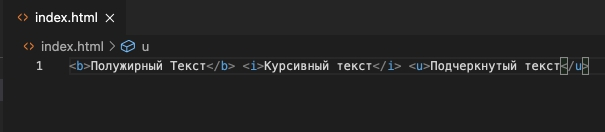
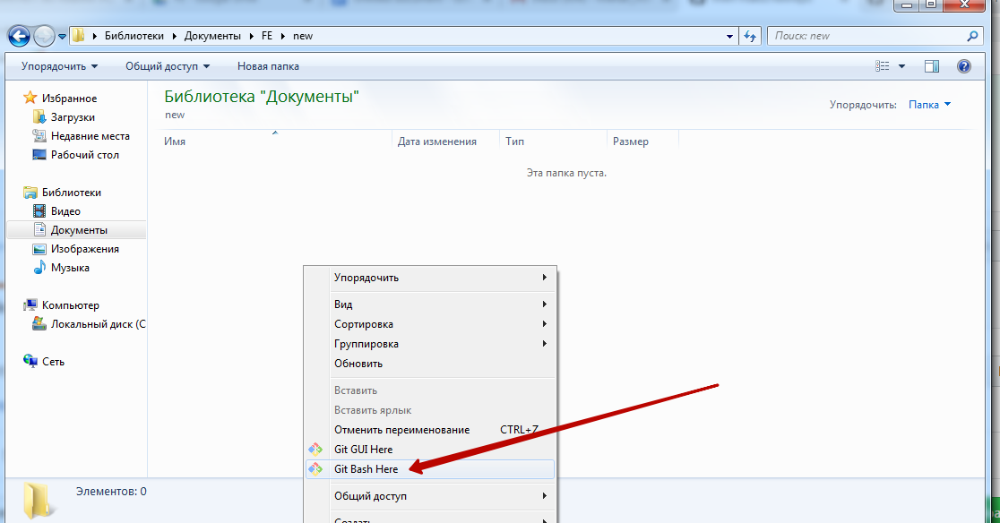
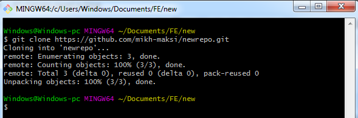

# Web-программирование
Курс предназначен для того, чтобы освоить элементы обучения для создания сайтов, освоив базу верстки сайтов, динамического изменения данных на сайте, работы бекенда и работы фреймворка react.js.  
В качестве практических заданий на данном курсе верстаются страницы сайтов, страницы с вычислениями, одностраничное приложение (one page application) в функционале которого реализованы тесты.  

В каждом блоке - описание выполнения задания (которое достаточно скопировать и запустить), а также усложняющие элементы (для выполнения которых необходимо вставить свой контент, изменить параметры или же реализовать продемонстрированную технологию в новых условиях).

## Рабочее место
Для того: чтобы писать Web-программы нам необходим редактор кода и программа, которая будет запускать эти программы (браузер).  
В качестве редактора кода мы будем использовать <a href = "https://code.visualstudio.com/download">Microsoft VS Code</a>, а в качестве браузера будем использовать <a href = "https://www.google.com/chrome/">Google Crome</a>.  
  
## Написание текста и его отображение в браузере

Для работы создайте папку **work** в корне одного из дисков (лучше на диске D, чтобы ограничения операционной системы не мешали работать).


1. Откройте созданную папку **work** в **MS VS Code**.  
  
 
  

2. Создадим файл **index.html** (с помощью кнопки **New File**)  
  

3. В рабочем поле введите слово "Текст"
  

4. Сохраните файл
  

5. Откройте и запустите файл **index.html** в папке **work**.
  

6. Вы увидите результат:
  

В ближашее время мы будем вводить код в рабочее поле редактора MS VS Code, сохранять код и результат видеть в браузере (при каждом новом сохранении обновляя страницу).

## Первые теги
**Теги** (метки) - позволяют изменять начертание текста. Тег `<b>` делает текст полужирным, тег `<i>` - написанным курсивом, а тег `<u>` - подчеркнутым.  
Для того, чтобы тег изменил наертание текста он должен быть заключен между открывающимся (`<b>`) и закрывающимся ((`</b>`)) тегом.  
Напишите в рабочем поле редактора **MS VS Code** следующий текст:
 
```html
<b>Полужирный Текст</b> <i>Курсивный текст</i> <u>Подчеркнутый текст</u>
```

   

Сохраните введенные теги и откройте файл index.html в браузере.  
  

## Абзац, ссылка, картинка


## Структура HTML-документа

1. В рабочем поле введем символ **!**, а далее, после появления выпадающего окна, нажмите **enter**.
  
  

## Оформление текста(Новость)

|№|Альтернативные задания|Код|Скриншот|
|---|---|---|---|
|1|1. Создайте страницу с тегами i,b,img,p,a|<a href = "https://github.com/mikh-maksi/karazin-fe/tree/main/simple-way#html">Код страницы</a>||

## HTML
```html
<h1>Объявлен стартовый состав сборной Украины на матч против Казахстана</h1>

<p>В <i>среду, 12 сентября</i>, в <b>Нур-Султане</b> на "<b>Астана Арене</b>" в рамках матча квалификации чемпионата мира-2022 
    в <b>Катаре</b> встретятся сборные <b>Казахстана</b> и <b>Украины</b>.</p>

<p>Стал известен стартовый состав сборной Украины:</p>

<p>Украина: Пятов, Миколенко, Мативенко, Забарный, Караваев, Соболь, Зинченко, Сидорчук, Ярмоленко, Буяльский, Яремчук.</p>

<p>ZN.UA проведет онлайн-трансляцию матча Казахстан - Украина.</p>

<p>Украина после трех игр отбора имеет в активе три очка, трижды сыграв вничью с Францией, Финляндией и Казахстаном. 
    Первая встреча команд в марте в Киеве завершилась со счетом 1:1.</p>

<p>Отметим, что этот поединок станет первым у руля сборной Украины для нового наставника команды Александра Петракова. 
    Начало встречи – в 17:00.</p>
<a href = "https://zn.ua/SPORT/objavlen-startovyj-sostav-sbornoj-ukrainy-na-match-protiv-kazakhstana.html">Взято с сайта Зеркало Недели</a>
```

## Вставка текста на GitHub Pages
Создание репозитария

1. Заходим на **github.com** (если не зарегистрированы - зарегистрироваться)
  
  

2. Создаем новый репозитарий


3. Или используем существующий


4. Нажимаем кнопку **"clone or download"**


5. Создаем новую папку и в ней на пустом месте нажимаем правую клавиши мыши, выбираем **gitBush Here** (если программа не установлена - скачать: https://git-scm.com/download/ )



6. В открывшемся окне пишем   и нажимаем комбинацию клавиш **Shift+INS**
  
  

Или нажимаем правой клавишей мыши после набранного Вводим команду **git push** (возможно - нужно будет указать логин и пароль к git hub) и выбираем "Вставить" (Paste)  


7. Нажимаем **"Enter"**  

  

8. Теперь в нашей созданной папке появилась новая под папка с названием таким же как название репозитария (в нашем случае **newrepo**)  
  

9.  Заходим в папку, создаем сайт (файлы **index.html**, **style.css**, картинки, шрифты, др.)
  
 

10. Создаем необходимые файлы  
  
  
11. Переходим в проводник и нажимаем правой клавишей на пустом месте и выбираем gitbush Here
  


В открывшимся окне пишем **git add .**  

  

12. Далее - вводим команду **git commit -m "first commit"**

  

13. Вводим команду git push (возможно - нужно будет указать логин и пароль к git hub)

  

## Тематический сайт (inline-blocks)
## Flexfroggy
## Тематический сайт (flexbox)
## Калькулятор
## Резюме
## Ответ на 1 вопрос
## Ответ на несколько вопросов
## Ответ на несколько вопросов (используем объект)
## Получение для вопросов данных с сервера
## Наполнение БД (MySQL)
## Создание endpoint
## React.js
